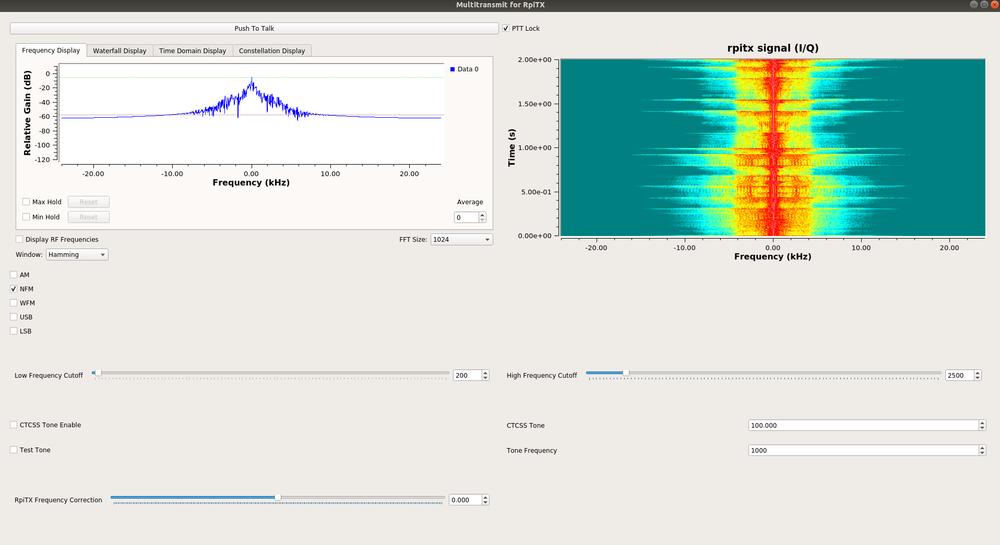

# gr-multitransmit-rpitx
A simple AM/FM/SSB modulator for rpitx in GRC 3.7x with QT GUI.
Created by Jayson Bucknell AA7NM Based on work by Alexandru Csete OZ9AEC and others. 

To connect run rpitx and set frequency on the Raspberry Pi for example:

while true; do (nc -l 8011; dd if=/dev/zero bs=4096 count=30); done | sudo rpitx -i- -m IQFLOAT -f 434000

Then set the TCP sink address and port (8011) to the location of the pi running rpitx.

Disable accelerated graphics dtoverlay=vc4-fkms-v3d in config.txt if running on a Raspberry Pi for a slow/unresponsive GNU Radio Companion GUI. See https://github.com/gnuradio/gnuradio/issues/2848

